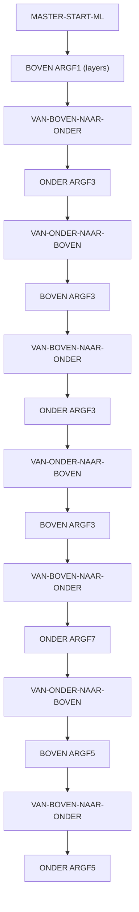

# FPX Codebase Analysis — Yaskawa Multi-Layer X-Seam Welding

> **Repository**: `arnereabel/claudecode_dev_container`
> **Branch**: `main` (3 commits, synced with `origin/main`)
> **Last Updated**: 2025-03-25
> **Analysis Date**: 2026-02-20

---

## 1. Repository Overview

A secure Claude Code devcontainer running on a Hetzner VPS (`89.167.13.134`), containing a **Yaskawa robot welding automation project** (`fpx/`) for multi-layer X-seam welding on **120mm thick steel plates**.

### File Tree (15 files total)

```
claudecode_dev_container/
├── .devcontainer/
│   ├── Dockerfile                    (2,598 B)  — Node.js 20 container + tools
│   ├── devcontainer.json             (1,715 B)  — VS Code config, mounts, firewall
│   └── init-firewall.sh              (4,522 B)  — iptables default-deny firewall
├── fpx/                              ← Main project workspace
│   ├── CLAUDE.md                     (1,604 B)  — JBI domain knowledge reference
│   ├── README.md                     (3,143 B)  — Architecture & usage docs
│   ├── job/
│   │   ├── MASTER-START-ML.JBI        (744 B)  — Orchestrator (7 cycles)
│   │   ├── MULTILAYER-TESTAFLOOP-BOVEN.JBI (4,066 B) — Top welding (12 layers)
│   │   ├── MULTILAYER-TESTAFLOOP-ONDER.JBI (5,291 B) — Bottom welding (19 layers)
│   │   ├── TESTUF-ARNE.JBI           (2,967 B)  — 4-point user frame teaching
│   │   ├── VAN-BOVEN-NAAR-ONDER.JBI   (570 B)  — Top→Bottom transition
│   │   └── VAN-ONDER-NAAR-BOVEN.JBI   (502 B)  — Bottom→Top transition
│   └── macro/
│       ├── ESAB1JOB.JBI               (900 B)  — ESAB weld job selection
│       ├── SHIFT-R1.JBI             (1,342 B)  — Position shift macro
│       └── WEAVING.JBI                (292 B)  — Weave pattern parameters
├── scripts/
│   └── setup-docker.sh              (2,202 B)  — Docker install script for VPS
├── CLAUDE.md                        (1,745 B)  — Root Claude Code instructions
├── README.md                        (2,267 B)  — Project quickstart / setup docs
└── nul                                (54 B)  — Windows artifact (can be deleted)
```

---

## 2. Architecture Deep Dive

### 2.1 Welding Program Flow



The master job initializes counters `B096`–`B099` to zero, then calls BOVEN/ONDER alternately with `ARGF` values specifying how many layers to add per pass:

| Pass | Job | ARGF | Layers Added |
|------|-----|------|-------------|
| 1 | BOVEN | ARGF1 | 1 |
| 2 | ONDER | ARGF3 | 3 |
| 3 | BOVEN | ARGF3 | 3 |
| 4 | ONDER | ARGF3 | 3 |
| 5 | BOVEN | ARGF3 | 3 |
| 6 | ONDER | ARGF7 | 7 |
| 7 | BOVEN | ARGF5 | 5 |
| 8 | ONDER | ARGF5 | 5 |
| **Total** | **BOVEN** | | **12 layers** |
| **Total** | **ONDER** | | **18–19 layers** |

### 2.2 Layer Parameter Tables

#### BOVEN (Top) — 12 Layers on UF#15

| Layer | ESAB Job | Weave (Amp/Freq/Angle) | Shift (X/Y/Z/Rx/Ry/Rz) |
|-------|----------|----------------------|------------------------|
| 0 (root) | 10 | 2.4 / 2.0 / 0.0 | No shift |
| 1 | 10 | 3.5 / 2.0 / 0.0 | 0/0/4/0/0/0 |
| 2 | 10 | 1.5 / 1.5 / 0.0 | 0/3/4/10/0/0 |
| 3 | 10 | 1.5 / 1.5 / 0.0 | 0/-3/4/-10/0/0 |
| 4 | 10 | 1.5 / 1.5 / 0.0 | 0/7/7/10/0/0 |
| 5 | 10 | 1.5 / 1.5 / 0.0 | 0/1/7/0/0/0 |
| 6 | 10 | 1.5 / 1.5 / 0.0 | 0/-6/7/-10/0/0 |
| 7 | 10 | 1.5 / 1.5 / 0.0 | 0/9/10/10/0/0 |
| 8 | 10 | 1.5 / 1.5 / 0.0 | 0/1/7/0/0/0 |
| 9 | 10 | 1.5 / 1.5 / 0.0 | 0/-8/13/-10/0/0 |
| 10 | 10 | 1.5 / 1.5 / 0.0 | 0/9/14/10/0/0 |
| 11 | 10 | 1.5 / 1.5 / 0.0 | 0/0/14/0/0/0 |

#### ONDER (Bottom) — 19 Layers on UF#25

| Layer | ESAB Job | Weave (Amp/Freq/Angle) | Shift (X/Y/Z/Rx/Ry/Rz) |
|-------|----------|----------------------|------------------------|
| 0 (root) | 11 | 1.5 / 1.5 / 15.0 | 0/0/0/0/0/0 |
| 1 | 11 | 1.2 / 1.5 / 5.0 | 0/-0.5/-7/8/0/0 |
| 2 | 11 | 1.2 / 1.5 / 25.0 | 0/0.5/-7/-8/0/0 |
| 3 | 11 | 1.2 / 1.5 / 25.0 | 0/3/-10/-10/0/0 |
| 4 | 11 | 1.5 / 1.5 / 15.0 | 0/0/-10/0/0/0 |
| 5 | 11 | 1.2 / 1.5 / 5.0 | 0/-3/-10/10/0/0 |
| 6 | 11 | 1.2 / 1.5 / 5.0 | 0/-5.5/-13/10/0/0 |
| 7 | 11 | 1.5 / 1.5 / 15.0 | 0/0/-13/0/0/0 |
| 8 | 11 | 1.2 / 1.5 / 25.0 | 0/5.5/-11/-10/0/0 |
| 9 | 11 | 1.2 / 1.5 / 25.0 | 0/7.5/-15/-10/0/0 |
| 10 | 11 | 1.5 / 1.5 / 15.0 | 0/3/-15/0/0/0 |
| 11 | 11 | 1.5 / 1.5 / 15.0 | 0/-3/-15/0/0/0 |
| 12 | 11 | 1.2 / 1.5 / 5.0 | 0/-7/-16/10/0/0 |
| 13 | 11 | 1.2 / 1.5 / 25.0 | 0/8.5/-20/-10/0/0 |
| 14 | 11 | 1.5 / 1.5 / 15.0 | 0/4/-20/0/0/0 |
| 15 | 11 | 1.5 / 1.5 / 15.0 | 0/-1/-20/0/0/0 |
| 16 | 11 | 1.5 / 1.5 / 15.0 | 0/-5/-20/0/0/0 |
| 17 | 11 | 1.2 / 1.5 / 5.0 | 0/-9/-23/10/0/0 |
| 18 | 11 | 1.2 / 1.5 / 25.0 | 0/10/-25/-10/0/0 |

### 2.3 Macros

#### ESAB1JOB — Weld Job Selection
- Accepts weld job number via `IARG#(1)`, writes to `MREG#(188)`
- Validates job exists via `IN#(34)` status check
- Error recovery: resets and retries once, then raises alarm `SETUALM 8000`
- Error check on `IN#(49)`–`IN#(52)` for fault conditions

#### SHIFT-R1 — Position Shift
- 7 arguments: X/Y/Z shift (mm), Rx/Ry/Rz shift (deg), User Frame number
- Converts mm → controller µm units (×1000), degrees → 10⁻⁴ deg units (×10000)
- Stores in `P[111]` and applies via `SFTON P[111] UF#[n]`
- Defaults to UF#15 if user frame arg is 0

#### WEAVING — Weave Parameters
- 3 arguments: amplitude, frequency, angle
- Multiplied by 10 for controller resolution
- Stored in `D080`, `D081`, `D082`
- Used by `WVON AMP=D080 FREQ=D081 ANGL=D082` in welding jobs

### 2.4 User Frame Teaching (TESTUF-ARNE)

4-step interactive process:
1. **Teach BOVEN start/end** → captured into `PX124`/`PX125` → stored as `P001`/`P002`
2. **Teach ONDER start/end** → captured into `PX126`/`PX127` → stored as `P003`/`P004`
3. **Create UF#15 (BOVEN)** from P124/P125 + synthetic 3rd point (100mm Y offset)
4. **Create UF#25 (ONDER)** from P126/P127 + synthetic 3rd point (100mm Y offset)

### 2.5 Transition Jobs

- **VAN-BOVEN-NAAR-ONDER**: 6-point pulse-mode joint path (VJ=100) moving robot from top to bottom
- **VAN-ONDER-NAAR-BOVEN**: 5-point pulse-mode joint path (VJ=100) — reverse of above

---

## 3. Infrastructure

### 3.1 Devcontainer
- **Base**: `node:20` with ZSH / Powerlevel10k / fzf / git-delta
- **Claude Code**: installed globally via npm
- **Network**: `NET_ADMIN` + `NET_RAW` capabilities for iptables firewall
- **Volumes**: bash history + Claude config persisted
- **Workspace**: bind-mounted at `/workspace`

### 3.2 Firewall (Default-Deny)
Allows **only**: npm registry, GitHub (IPs from API), `api.anthropic.com`, Sentry, Statsig, VS Code marketplace. Everything else is **REJECT**ed. Verified at startup by testing `example.com` (blocked) and `api.github.com` (allowed).

### 3.3 VPS Setup Script
Standard Docker CE install for Ubuntu with:
- JSON log driver with 10MB/3-file rotation
- Docker group setup for non-root user

---

## 4. Git Status

| Item | Value |
|------|-------|
| Branch | `main` |
| Remote | `origin/main` (synced) |
| Commits | 3 (Initial setup → CLAUDE.md + docs → JBI comments) |
| Untracked | `nul` (Windows artifact) |
| .gitignore | Not present |

---

## 5. Observations & Potential Issues

### 🔴 Code-Level
1. **No `.gitignore`** — risk of committing editor files, OS artifacts (the `nul` file is already present)
2. **BOVEN layer 0 has no `SFTOF`** before its `MACRO1 MJ#(2)` call — all other layers have `SFTOF` first
3. **ONDER layer 0 does not call `MACRO1 MJ#(0) ARGF11`** — it only calls WEAVING and SHIFT, while all other layers call ESAB1JOB first (ESAB1JOB is called once before the `JUMP LABEL:` but not reset for layer 0's shift)
4. **Inconsistent `SFTOF` ordering in ONDER layers 16–18** — `MACRO1 MJ#(0)` is called before `SFTOF`, while all earlier layers do `SFTOF` first
5. **MASTER layer distribution**: ARGF values (1+3+3+3+3+7+5+5 = 30) should equal 12+19=31 total layers — possible off-by-one issue
6. **TESTUF-ARNE re-uses P126**: Step 5 sets `P128 = P126`, but P126 was already overwritten by `CNVRT PX126 PX126 RF` — the ONDER third point may be incorrect

### 🟡 Architecture-Level
7. **Hardcoded layer parameters** — each layer's shift/weave values are individually hardcoded; no parameterization or external config
8. **No error recovery in welding sequences** — if `ARCON` fails or a fault occurs mid-weld, there's no branch/recovery in the welding jobs (only ESAB1JOB has error handling)
9. **Transition paths are pulse-encoded** — tightly coupled to a specific robot configuration; won't transfer to different cell setups
10. **No dry-run / simulation mode** — can't test the program logic without actually running the robot

### 🟢 Documentation
11. Existing README and CLAUDE.md are **well-structured** and comprehensive
12. JBI comments were recently added (commit 3) and explain the intent clearly

---

## 6. Questions for Planning Phase

Before making any changes, the following questions will guide the plan:

1. **What is the immediate goal?** Bug fixing / parameter tuning / adding new features / refactoring / creating tooling?
2. **Are the layer counts correct?** The ARGF distribution (1+3+3+3+3+7+5+5=30) doesn't match BOVEN 12 + ONDER 19 = 31. Is layer 0 counted separately?
3. **Is the inconsistent `SFTOF` ordering in ONDER layers 16–18 intentional** or a bug?
4. **Should a `.gitignore` be created** to exclude OS files, editor configs, etc.?
5. **Is there a welding parameter sheet or spec document** that defines the shift/weave values per layer?
6. **Are there plans to make layer parameters configurable** (e.g., via an external CSV/JSON file that generates JBI)?
7. **What's the target controller?** YRC1000 / YRC1000micro / DX200?
8. **Is there a test/simulation environment** available, or is all testing done on the physical robot?
